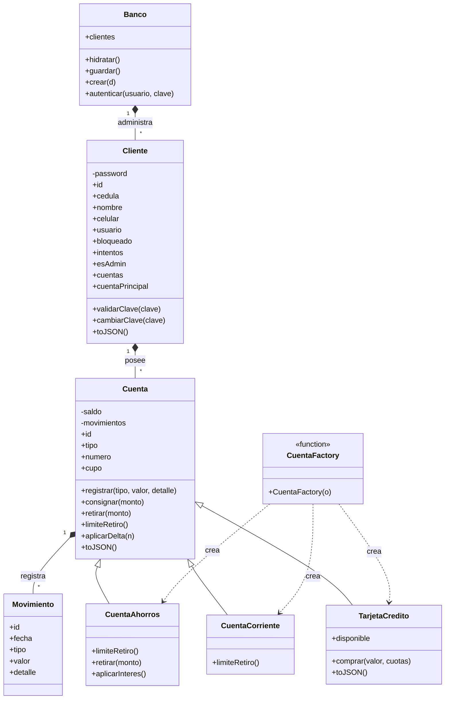

# Mi Plata — Cajero Web

Proyecto académico de banca digital desarrollado con **HTML, CSS y JavaScript**, aplicando conceptos de Programación Orientada a Objetos.

> **Nota:** esta versión conserva la lógica funcional del proyecto. La principal modificación es la organización del código para facilitar su lectura, mantenimiento y sustentación.

## Tecnologías

- HTML5
- CSS3
- JavaScript
- Programación Orientada a Objetos
- LocalStorage
- Mermaid para el diagrama UML

## Funcionalidades

- Registro e inicio de sesión.
- Cuenta de ahorros.
- Cuenta corriente.
- Tarjeta de crédito.
- Consignaciones y retiros.
- Transferencias.
- Historial de movimientos.
- Perfil y cambio de contraseña.
- Administración de usuarios.
- Persistencia de datos mediante `localStorage`.
- Centro de acciones y microinteracciones.

## Estructura del proyecto

```text
mi-plata-final/
├── index.html                 # Estructura principal de la interfaz
├── styles.css                 # Diseño visual y responsive
├── README.md                  # Documentación del proyecto
└── js/
    ├── main.js                # Punto de entrada de la aplicación
    ├── utils.js               # Utilidades y formateadores
    ├── state.js               # Estado de sesión y referencias DOM
    ├── models/
    │   ├── Cuenta.js          # Cuenta y tipos de cuenta
    │   ├── Cliente.js         # Modelo de cliente
    │   ├── factories.js       # Creación del tipo de cuenta
    │   └── index.js           # Exportaciones de modelos
    ├── services/
    │   └── Banco.js           # Persistencia y autenticación
    └── ui/
        ├── views.js           # Vistas y formularios
        ├── events.js          # Eventos globales
        └── interactions.js    # Microinteracciones
```

## ¿Cómo se organizó JavaScript?

El antiguo `app.js` concentraba modelos, lógica bancaria, interfaz y eventos en un solo archivo. Para hacerlo más fácil de estudiar, se separó por responsabilidades:

- **`models/`**: representa las entidades del sistema.
- **`services/`**: contiene la lógica general del banco y la persistencia.
- **`ui/`**: construye las vistas y controla los eventos de la interfaz.
- **`utils.js`**: reúne funciones auxiliares reutilizables.
- **`state.js`**: centraliza el estado compartido de la aplicación.
- **`main.js`**: inicia la aplicación.

## Diagrama UML



## Conceptos de POO utilizados

### Encapsulamiento

Se utilizan propiedades privadas con `#`, por ejemplo el saldo y los movimientos de una cuenta.

### Herencia

`CuentaAhorros`, `CuentaCorriente` y `TarjetaCredito` heredan de `Cuenta` mediante `extends`.

### Polimorfismo

Los diferentes tipos de cuenta pueden modificar comportamientos heredados, como el límite o las condiciones de retiro.

### Factory

`CuentaFactory()` recibe los datos de una cuenta y crea la clase correspondiente según su tipo.

## Ejecución

Como el proyecto utiliza módulos JavaScript (`type="module"`), se recomienda ejecutarlo mediante un servidor local en lugar de abrir el HTML directamente con `file://`.

Por ejemplo, desde VS Code se puede utilizar **Live Server**.

## Proyecto académico

**Mi Plata — Cajero Web**  
Desarrollo de Software · CESDE
