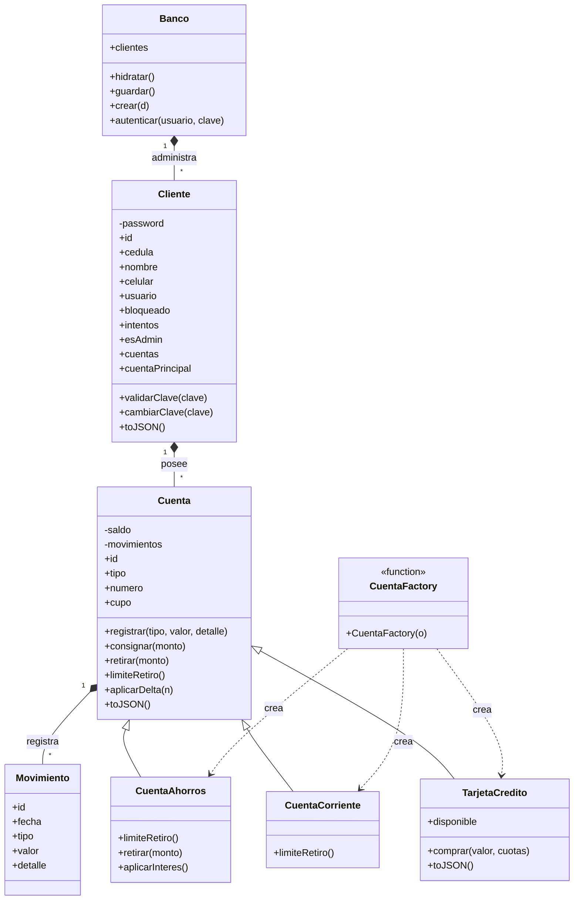

## Diagrama UML

```mermaid
classDiagram
    class Banco {
        +clientes
        +hidratar()
        +guardar()
        +crear(d)
        +autenticar(usuario, clave)
    }

    class Cliente {
        -password
        +id
        +cedula
        +nombre
        +celular
        +usuario
        +bloqueado
        +intentos
        +esAdmin
        +cuentas
        +validarClave(clave)
        +cambiarClave(clave)
        +cuentaPrincipal
        +toJSON()
    }

    class Cuenta {
        -saldo
        -movimientos
        +id
        +tipo
        +numero
        +cupo
        +registrar(tipo, valor, detalle)
        +consignar(monto)
        +retirar(monto)
        +limiteRetiro()
        +aplicarDelta(n)
        +toJSON()
    }

    class CuentaAhorros {
        +limiteRetiro()
        +retirar(monto)
        +aplicarInteres()
    }

    class CuentaCorriente {
        +limiteRetiro()
    }

    class TarjetaCredito {
        +disponible
        +comprar(valor, cuotas)
        +toJSON()
    }

    class Movimiento {
        +id
        +fecha
        +tipo
        +valor
        +detalle
    }

    class CuentaFactory {
        <<function>>
        +CuentaFactory(o)
    }

    Banco "1" *-- "*" Cliente : administra
    Cliente "1" *-- "*" Cuenta : posee
    Cuenta "1" *-- "*" Movimiento : registra
    Cuenta <|-- CuentaAhorros
    Cuenta <|-- CuentaCorriente
    Cuenta <|-- TarjetaCredito
    CuentaFactory ..> CuentaAhorros : crea
    CuentaFactory ..> CuentaCorriente : crea
    CuentaFactory ..> TarjetaCredito : crea
```
