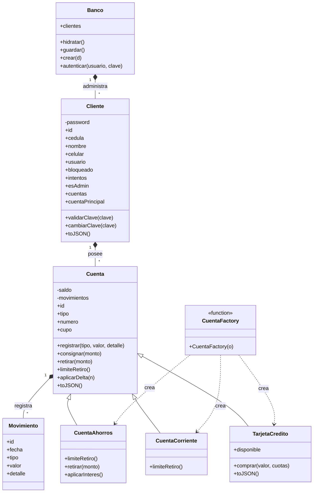

## Diagrama UML

## 📋 Historias de usuario

El proyecto cuenta con 12 historias de usuario que describen las principales funcionalidades de **Mi Plata**.

👉 [Ver historias de usuario](docs/historias-usuario.md)

## 🖥️ Maqueta responsive

La maqueta del proyecto presenta la interfaz de **Mi Plata** para diferentes tamaños de pantalla: escritorio, tablet y smartphone.

👉 [Ver maqueta responsive](docs/maqueta.png)

## 👥 Roles del equipo

### José Berrío
- Desarrollo de la estructura HTML.
- Participación en la programación JavaScript.

### Juan Pablo Quiceno
- Desarrollo de gran parte de la lógica JavaScript.
- Construcción de la maquetación e interfaz del proyecto.

### Braian Ocampo
- Participación en el desarrollo JavaScript.
- Elaboración del diagrama UML.
- Elaboración de las historias de usuario.

### Trabajo colaborativo
- Construcción y diseño de los estilos CSS.
- Pruebas y ajustes visuales del proyecto.
- Integración de los diferentes componentes.
